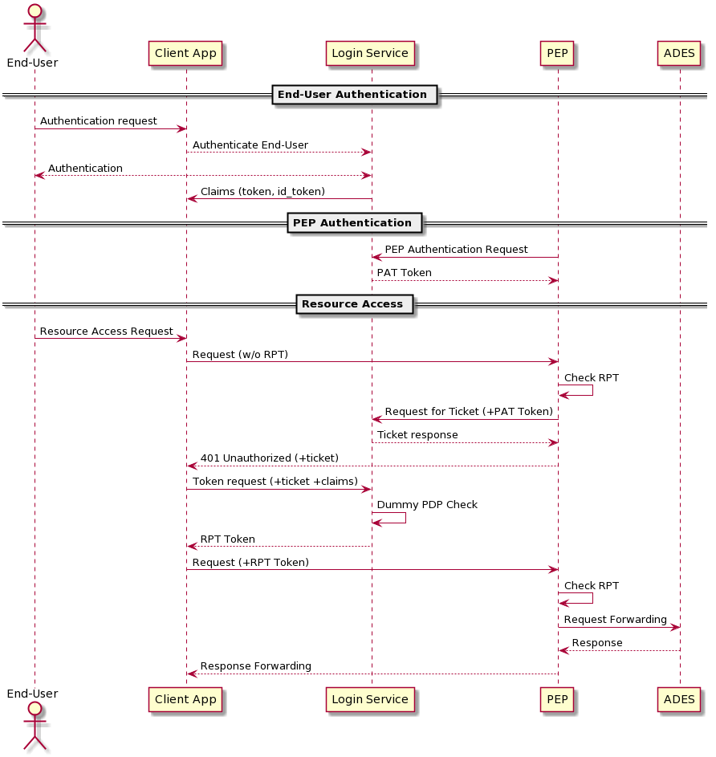

[[mainComponents]]
= Building Block Design

[NOTE]
.Content Description
================================
This section contains:

* A concise breakdown of the Building Block in several independent services (when applicable). For each component, the following subsections are added:
** Overview and purpose: indicating the functionality covered by the component
** SW Reuse and Dependencies: indicating reuse of third party open source solutions (if any) and any pre-required Dependencies
** Interfaces: both internal to the building block and those exposed externally
** Data: Data usage of the building block, data flow and any GDPR concerns should be addressed here
** Applicable Resources: links and references to (Reference Docs), and repositories.

When a breakdown is necessary, a general overview of the building block can be given. On the contrary, no breakdown indicates a single component development with the same expected sections.

================================

== Reverse Proxy Service
=== Overview and Purpose
The Flask-based reverse proxy serves as the interface for input queries. This reverse proxy is in charge of recieving the queries and returning the appropiate HTTP response. 

=== Software Reuse and Dependencies

All requirements for the executing of the reverse proxy are found under src/requirements.txt, and expect Python 3.6.9 or greater to work.

The most important are:

* **EOEPCA-SCIM**: Used to auto-register itself as a client to the Auth. Server upon startup
* **EOEPCA-UMA**: Used as the backbone of the PEP, allows for generation of tickets, verification of RPTs, and any other UMA-related action.
* **WellKnownHandler**: Used to dynamically check the configuration of the Authorization Server on each execution. For example, it can get the needed endpoints for any API the PEP needs, such as the token request for OIDC.
* **Flask**: External to EOEPCA's project, this library allows the PEP to create the actual reverse proxy, sending and recieving custom requests.

=== Interfaces

This component doesn't have any internal interfaces. For a reference of external interfaces see <<External Interfaces>> on Section 2 <<Overview>>

=== Data

==== Configuration

The PEP gets all its configuration from the file located under `config/config.json`.

The parameters that are accepted, and their meaning, are as follows:

- **realm**: 'realm' parameter answered for each UMA ticket. Default is "eoepca"
- **auth_server_url**: complete url (with "https") of the Authorization server.
- **proxy_endpoint**: "/path"-formatted string to indicate where the reverse proxy should listen. The proxy will catch any request that starts with that path. Default is "/pep"
- **service_host**: Host for the proxy to listen on. For example, "0.0.0.0" will listen on all interfaces
- **service_port**: Port for the proxy to listen on. By default, **5566**. Keep in mind you will have to edit the docker file and/or kubernetes yaml file in order for all the prot forwarding to work.
- **s_margin_rpt_valid**: An integer representing how many seconds of "margin" do we want when checking RPT. For example, using **5** will make sure the provided RPT is valid now AND AT LEAST in the next 5 seconds.
- **check_ssl_certs**: Toggle on/off (bool) to check certificates in all requests. This should be forced to True in a production environment
- **use_threads**: Toggle on/off (bool) the usage of threads for the proxy. Recommended to be left as True.
- **debug_mode**: Toggle on/off (bool) a debug mode of Flask. In a production environment, this should be false.
- **resource_server_endpoint**: Complete url (with "https" and any port) of the Resource Server to protect with this PEP.
- **client_id**: string indicating a client_id for an already registered and configured client. **This parameter is optional**. When not supplied, the PEP will generate a new client for itself and store it in this key inside the JSON.
- **client_secret**: string indicating the client secret for the client_id. **This parameter is optional**. When not supplied, the PEP will generate a new client for itself and store it in this key inside the JSON.

==== Data flow

The only information the PEP handles are tickets given by the Auth Server, and RPTs which are sent only to the Auth Server.

All data is ephimeral at the time of writting, except the data stored at the config file. The resources are loaded into memory, but in the future they will be stored on a separate database to allow large amounts of resources and more complex queries.

What follows is an example of the nominal flow for the PEP, and "ADES" is the Resource Server the PEP is protecting:

=== Extensibility

The design of the PEP allows for further improvements if need be. For example:

- The resource management in memory could be expanded to a full on DB, by changing how `custom_uma.py` works internally.
- The UMA library used allows for quick implementations for resource managing, such as creation, deleting and editing.
- The proxy can be expanded to parse further parameters on top of the HTTP protocol, allowing for any kind of plugin or complex mechanism desired.

=== Applicable Resources

* UMA 2.0 Specification - https://docs.kantarainitiative.org/uma/wg/rec-oauth-uma-grant-2.0.html
* EOEPCA's SCIM Client - https://github.com/EOEPCA/um-common-scim-client
* EOEPCA's UMA Client - https://github.com/EOEPCA/um-common-uma-client
* EOEPCA's Well Known Handler - https://github.com/EOEPCA/well-known-handler
* Flask - https://github.com/pallets/flask

== CLI
=== Overview and Purpose

Included with the PEP there is a folder with scripts at `/CLI`. These scripts serve as a demo tool, and could be used in testing. For more information on what variables are expected, all scripts incorporate a '-h' help command.

The files are the following:

* **authenticate-user.sh**: Takes credentials for a client and a user, and uses them to get an id_token from the Auth Server. This token can be used in other scripts or actions as long as it is valid.
* **get-rpt.sh**: Will use a ticket and credentials in the form of an id_token to request an RPT to access a resource.
* **request-resource.sh**: This script interacts with the PEP, and will make requests to it with the given parameters. It's a clean way of composing a correct http request to the PEP.

=== Software Reuse and Dependencies

The scripts need the library 'WellKnownHandler', to dynamically get the correct endpoints for the auth server, and thus they also need Python 3.6.9 or greater to execute it.

Other than that, only Bash and Curl are required.

=== Applicable Resources

* UMA 2.0 Specification - https://docs.kantarainitiative.org/uma/wg/rec-oauth-uma-grant-2.0.html
* EOEPCA's Well Known Handler - https://github.com/EOEPCA/well-known-handler
